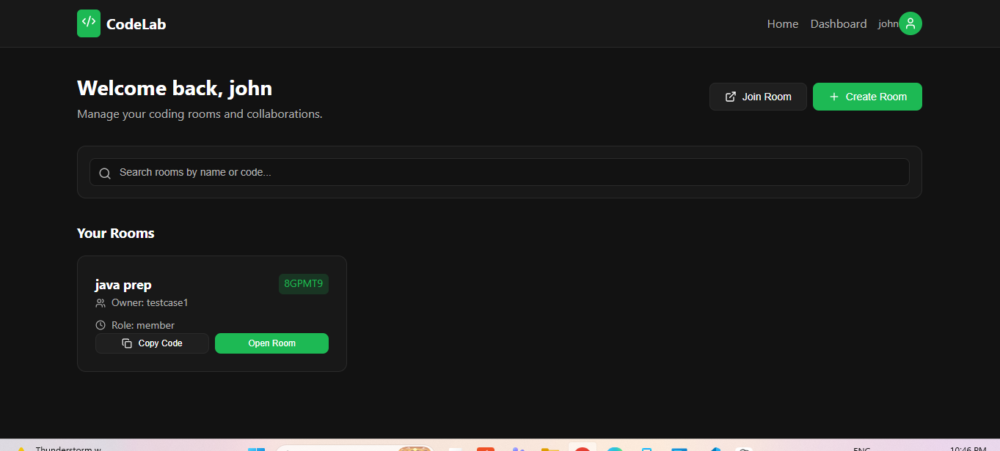
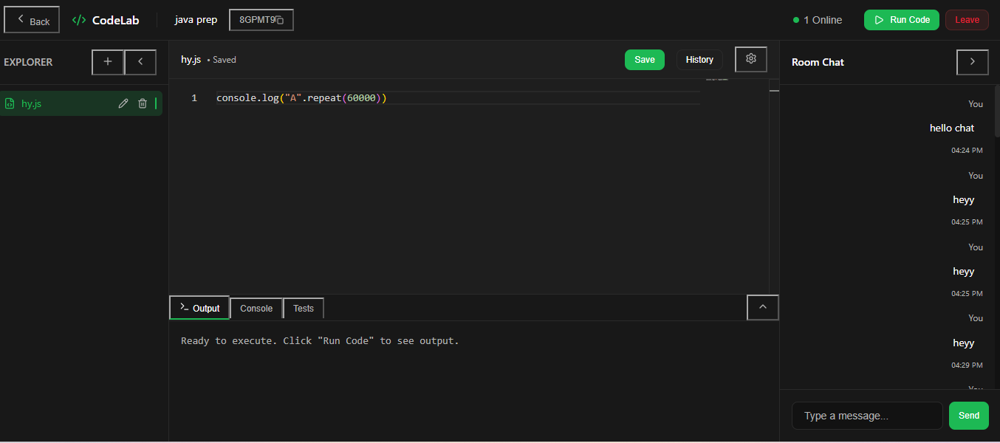

# 🚀 CodeLab — Browser-Based Collaborative Coding Platform

CodeLab is a full-stack, browser-based collaborative coding platform where users can create coding rooms, write code together in real time, chat with teammates, and work inside a shared workspace — all without refreshing the page.

## 🎥 Demo Video

[](https://youtu.be/2FDSyVD23rQ)

▶️ **Watch the demo:** https://youtu.be/2FDSyVD23rQ

---

## 📸 Screenshots

### Home Page


### Dashboard


### Collaborative Coding Room


---

## ✨ Features

### Implemented & tested
- 🔐 **Authentication** — registration and login with JWT-based auth and protected routes
- 🏠 **Dashboard** — create rooms and view **My Rooms**
- 🧑‍💻 **Coding rooms** — each room is a shared workspace at `/room/:roomId`
- 📝 **Monaco Editor** — the same editor technology that powers VS Code, running in the browser
- ⚡ **Real-time code sync** — edits made by one user appear instantly in other browsers in the same room, no refresh needed
- 💬 **Room chat** — real-time messaging with correct per-user attribution
- 👥 **Multi-user tested** — verified with multiple browser sessions and separate accounts
- ▶️ **Code execution** — run code from the browser and view the output or errors
- 🐳 **Isolated execution with Docker** — user code runs in a container instead of inside the main Node.js process, keeping the backend safer
- 🔒 **Environment-based config** — secrets and URLs kept out of source code

---

## 🛠️ Tech Stack

| Layer | Technologies |
|---|---|
| **Frontend** | React.js, JavaScript (JSX), React Router, Monaco Editor, Socket.IO Client, HTML, CSS, Vite |
| **Backend** | Node.js, Express.js, REST APIs, Socket.IO, JWT |
| **Database** | PostgreSQL 18 |
| **Infrastructure / Tools** | Docker, Docker Desktop, WSL 2, Git, GitHub, VS Code, Thunder Client |

> The frontend is written in **JavaScript/JSX**, not TypeScript.

---

## 🧱 Architecture

```text
React Frontend
       ↓
REST API / Socket.IO
       ↓
Node.js + Express Backend
       ↓
PostgreSQL
```

CodeLab uses two communication channels, each for what it does best:

- **REST APIs** → registration, login, creating/retrieving rooms, persistent data
- **Socket.IO** → real-time code synchronization, chat, and room events

The React frontend never talks to the database directly; all data access goes through the Express backend.

### Real-time collaboration flow

```text
User A edits code in Monaco
        ↓
Socket.IO client emits "code-change" (roomCode, fileId, code)
        ↓
Socket.IO server receives the event
        ↓
Server broadcasts to other sockets in the same room
        ↓
User B's Monaco Editor updates instantly
```

Socket.IO **rooms** ensure users only receive events from the coding room they have joined.

### Code-execution flow

```text
User clicks "Run Code"
        ↓
Backend
        ↓
Docker container (isolated environment)
        ↓
Program output / errors
        ↓
Frontend
```

---

## 🗺️ Frontend Routes

| Route | Description |
|---|---|
| `/` | Home page |
| `/login` | User login |
| `/register` | User registration |
| `/dashboard` | Create rooms and view My Rooms |
| `/room/:roomId` | Collaborative coding room (editor + chat + sync) |

---

## 🔐 Authentication

1. User registers or logs in from the React frontend.
2. The Express API validates credentials against PostgreSQL.
3. On success, the server issues a **JWT** (expires in about 1 hour).
4. The frontend sends the token with protected requests:

```text
Authorization: Bearer <JWT>
```

5. Authentication middleware on the backend verifies the token before allowing access.

The JWT secret is loaded from environment variables and is never hardcoded.

---

## 📁 Project Structure

```text
codelab/
├── frontend/     # React + Vite app (Monaco Editor, Socket.IO client)
└── backend/      # Express API + Socket.IO server (server.js)
```

---

## ⚙️ Getting Started

### Prerequisites
- Node.js
- PostgreSQL 18
- Git
- (Optional, for code execution work) Docker Desktop with WSL 2

### 1. Clone the repository

```bash
git clone <your-repo-url>
cd codelab
```

### 2. Set up the backend

```bash
cd backend
npm install
```

Create a `.env` file in `backend/`:

```env
PORT=5000
DB_HOST=localhost
DB_PORT=5432
DB_USER=your_db_user
DB_PASSWORD=your_db_password
DB_NAME=codelab
JWT_SECRET=your_strong_secret
FRONTEND_URL=http://localhost:5173
```

Start the server:

```bash
node server.js
```

The backend runs at **http://localhost:5000**.

### 3. Set up the frontend

```bash
cd frontend
npm install
```

Create a `.env` file in `frontend/`:

```env
VITE_API_URL=http://localhost:5000
VITE_SOCKET_URL=http://localhost:5000
```

Start the dev server:

```bash
npm run dev
```

### 4. Try it out

1. Register two accounts.
2. Log in as User A in one browser and User B in another (or use an incognito window).
3. Create a room from the dashboard and open the same room in both sessions.
4. Edit code and send chat messages — changes appear in real time.

---

## 🧪 Challenges Solved

- **`401 Unauthorized` on protected routes** — fixed the JWT flow between frontend and backend middleware.
- **My Rooms retrieval** — corrected authenticated room fetching.
- **Real-time sync** — implemented Monaco ↔ Socket.IO synchronization across browsers.
- **Chat attribution** — fixed messages being tied to the wrong account across two sessions.
- **Docker setup** — configured Docker Desktop and WSL 2 and verified with `hello-world` and a Node.js container.

---

## 🔮 Roadmap

- [ ] Support for more programming languages
- [ ] Additional workspace capabilities (e.g., multi-file support)
- [ ] Execution hardening (time and resource limits)
- [ ] Production hardening and deployment

---

## 📌 Summary

CodeLab is a full-stack collaborative coding platform built with React, Node.js, Express, PostgreSQL, Socket.IO, JWT authentication, and Monaco Editor, with Docker used for the isolated code-execution architecture. Its standout capability is **real-time collaborative coding**: multiple users enter the same room, edit code together, and chat, with changes synced instantly and no page refresh.

---

## 👤 Author

**Srinilaya**

---

## 📄 License

This project is licensed under the **MIT License**. See the [LICENSE](LICENSE) file for details.
